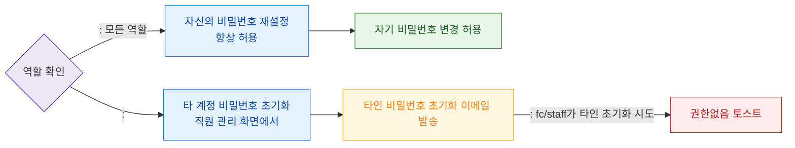

# F7 권한(RBAC) 분기 플로우 — SCR-106 비밀번호 재설정

## 목적
비밀번호 재설정은 모든 역할이 자신의 계정에 대해 수행 가능하며, 관리자는 타인 비밀번호 초기화 권한을 갖는다.

## 다이어그램

## TC 후보

| TC ID | 타입 | Given | When | Then | |-------|------|-------|------|------| | TC-106-F7-01 | positive | staff | 자신의 비밀번호 재설정 | 허용 | | TC-106-F7-02 | positive | manager | 타 직원 비밀번호 초기화 | 초기화 이메일 발송 | | TC-106-F7-03 | negative | fc | 타인 비밀번호 초기화 시도 | 권한없음 토스트 |
