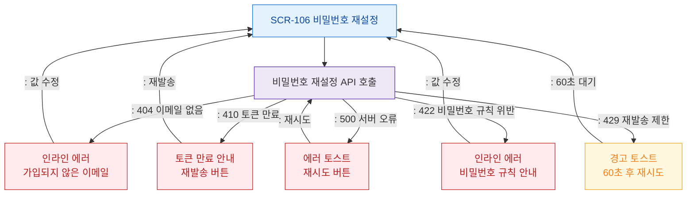

# F8 에러/예외/복구 플로우 — SCR-106 비밀번호 재설정

## 목적
비밀번호 재설정 API 오류 분기와 복구 경로를 정의한다.

## 다이어그램

## TC 후보

| TC ID | 타입 | Given | When | Then | |-------|------|-------|------|------| | TC-106-F8-01 | negative | (비로그인) | 미가입 이메일 입력 | 인라인 에러 표시 | | TC-106-F8-02 | negative | (비로그인) | 만료 토큰으로 접근 | 재발송 버튼 안내 | | TC-106-F8-03 | negative | (비로그인) | 비밀번호 규칙 위반 | 규칙 인라인 에러 | | TC-106-F8-04 | negative | (비로그인) | 60초 내 재발송 시도 | 경고 토스트 + 쿨다운 |
