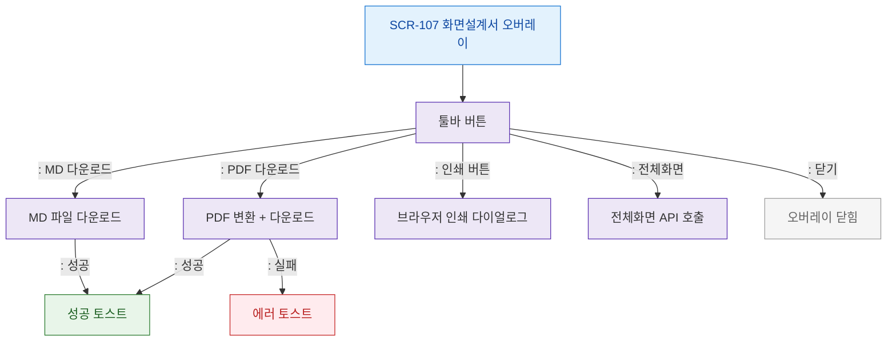

# F3 버튼/액션 플로우 — SCR-107 화면설계서 오버레이

## 목적
툴바 버튼(다운로드/인쇄/전체화면/닫기) 및 키보드 단축키 동작을 정의한다.

## 다이어그램

## TC 후보

| TC ID | 타입 | Given | When | Then | |-------|------|-------|------|------| | TC-107-F3-01 | positive | manager | PDF 다운로드 클릭 | 다운로드 완료 토스트 | | TC-107-F3-02 | positive | manager | MD 다운로드 클릭 | MD 파일 다운로드 | | TC-107-F3-03 | positive | manager | 전체화면 버튼 | 전체화면 모드 전환 | | TC-107-F3-04 | negative | manager | PDF 변환 실패 | 에러 토스트 |
