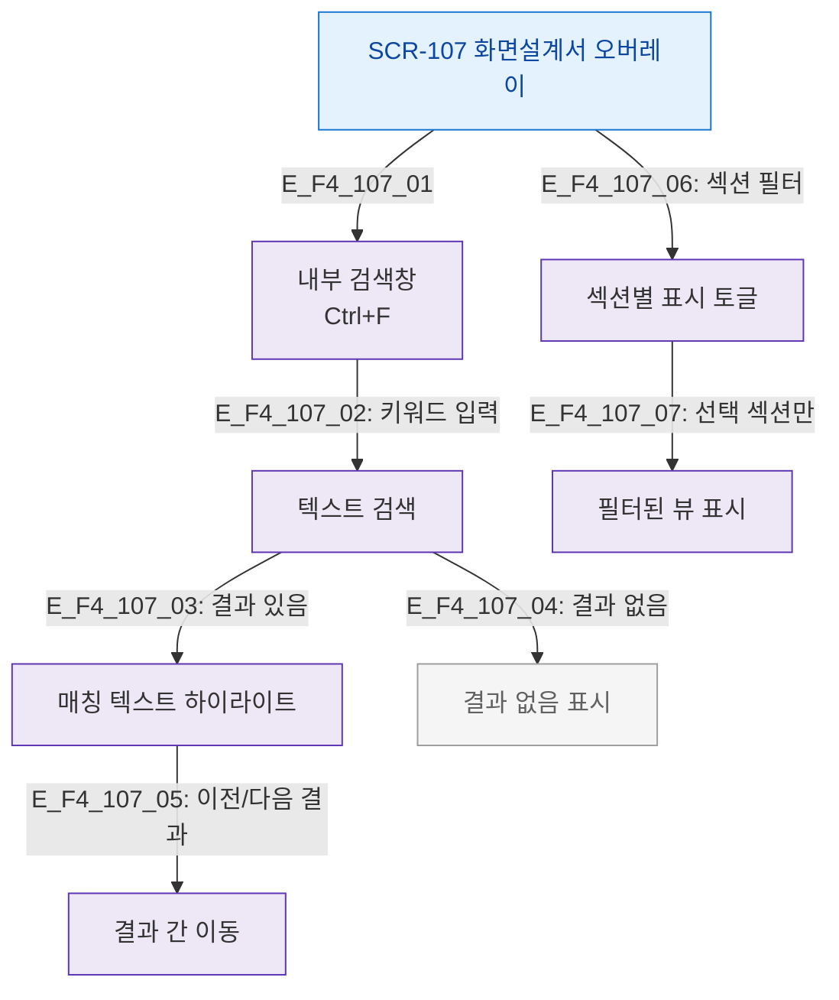

# F4 필터/검색 플로우 — SCR-107 화면설계서 오버레이

## 목적
설계서 내 텍스트 검색 및 섹션/태그 필터 흐름을 정의한다.

## 다이어그램

## TC 후보

| TC ID | 타입 | Given | When | Then |
|-------|------|-------|------|------|
| TC-107-F4-01 | positive | manager | 키워드 입력 | 매칭 텍스트 하이라이트 |
| TC-107-F4-02 | positive | manager | 다음 결과 버튼 | 다음 매칭으로 이동 |
| TC-107-F4-03 | negative | manager | 검색 결과 없음 | 결과 없음 표시 |
