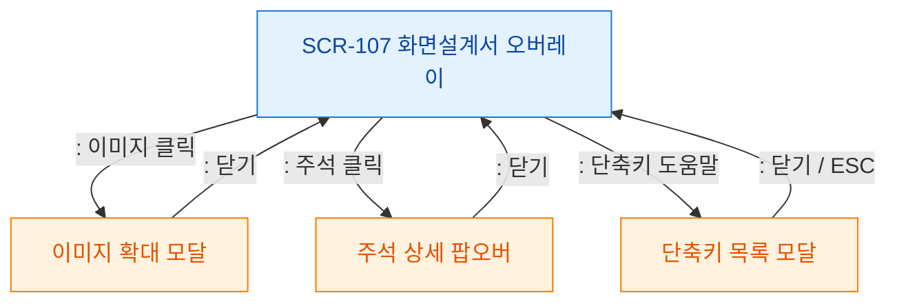

# F5 모달 트리거 트리 — SCR-107 화면설계서 오버레이

## 목적
오버레이 자체가 최상위 레이어이며 내부에서 추가 트리거가 발생하는 경로를 정의한다.

## 다이어그램

## TC 후보

| TC ID | 타입 | Given | When | Then | |-------|------|-------|------|------| | TC-107-F5-01 | positive | manager | 이미지 클릭 | 이미지 확대 모달 열림 | | TC-107-F5-02 | positive | manager | 주석 클릭 | 주석 상세 팝오버 열림 | | TC-107-F5-03 | positive | manager | 단축키 도움말 | 단축키 목록 모달 열림 |
