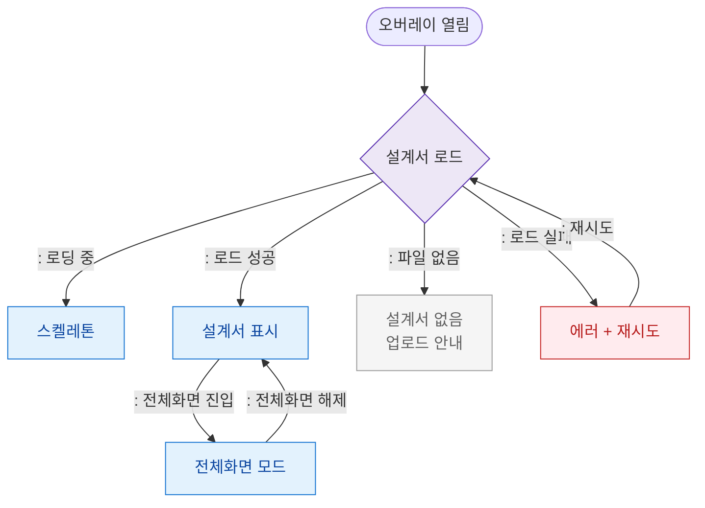

# F6 상태별 화면 플로우 — SCR-107 화면설계서 오버레이

## 목적
오버레이 로딩/정상/빈/에러 상태별 UI 분기를 정의한다.

## 다이어그램

## TC 후보

| TC ID | 타입 | Given | When | Then | |-------|------|-------|------|------| | TC-107-F6-01 | positive | manager | 오버레이 열림 | 스켈레톤 후 설계서 표시 | | TC-107-F6-02 | positive | manager | 전체화면 버튼 | 전체화면 모드 전환 | | TC-107-F6-03 | negative | manager | 설계서 파일 없음 | 빈 상태 + 업로드 안내 | | TC-107-F6-04 | negative | manager | 로드 실패 | 에러 + 재시도 버튼 |
