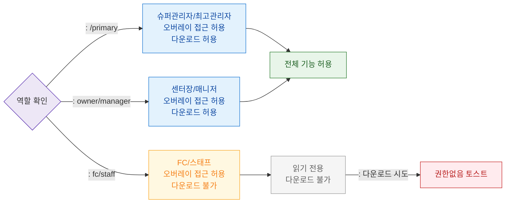

# F7 권한(RBAC) 분기 플로우 — SCR-107 화면설계서 오버레이

## 목적
역할별 설계서 오버레이 접근 가능 여부를 정의한다.

## 다이어그램

## TC 후보

| TC ID | 타입 | Given | When | Then | |-------|------|-------|------|------| | TC-107-F7-01 | positive | manager | 오버레이 열기 | 접근 허용 + 다운로드 버튼 표시 | | TC-107-F7-02 | positive | staff | 오버레이 열기 | 읽기 전용 표시 | | TC-107-F7-03 | negative | fc | 다운로드 버튼 클릭 | 권한없음 토스트 |
