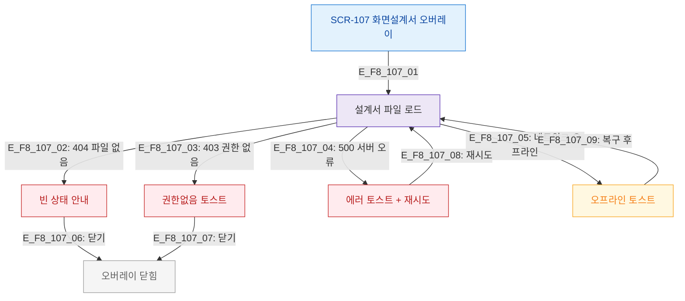

# F8 에러/예외/복구 플로우 — SCR-107 화면설계서 오버레이

## 목적
설계서 로드/다운로드 오류와 복구 경로를 정의한다.

## 다이어그램

## TC 후보

| TC ID | 타입 | Given | When | Then |
|-------|------|-------|------|------|
| TC-107-F8-01 | negative | manager | 설계서 파일 없음 | 빈 상태 안내 |
| TC-107-F8-02 | negative | manager | 500 서버 오류 | 에러 토스트 + 재시도 |
| TC-107-F8-03 | negative | manager | 오프라인 상태 | 오프라인 토스트 |
