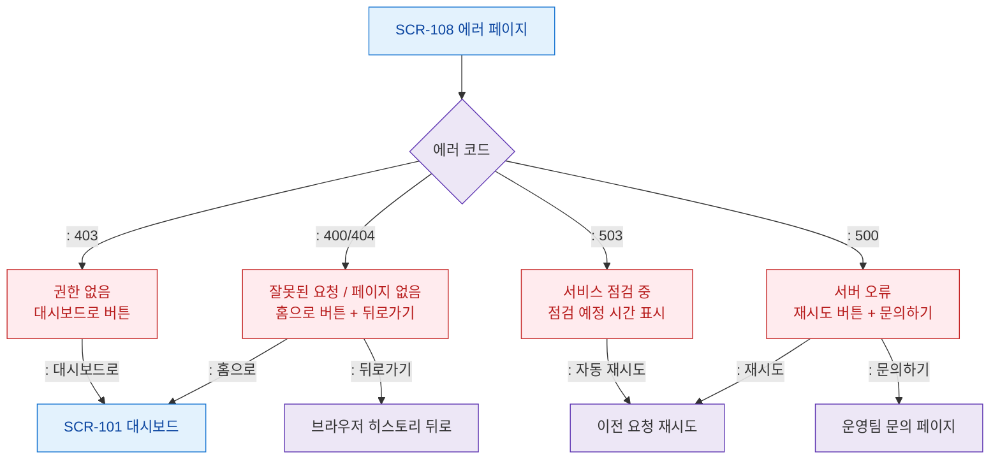

# F2 메인 인터랙션 플로우 — SCR-108 에러 페이지

## 목적
에러 페이지에서 제공하는 복구 액션(뒤로가기/홈/재시도/문의)을 정의한다.

## 다이어그램

## TC 후보

| TC ID | 타입 | Given | When | Then | |-------|------|-------|------|------| | TC-108-F2-01 | positive | manager | 404 페이지 홈으로 버튼 | 대시보드 이동 | | TC-108-F2-02 | positive | manager | 403 페이지 대시보드로 버튼 | 대시보드 이동 | | TC-108-F2-03 | positive | manager | 500 페이지 재시도 버튼 | 이전 요청 재시도 | | TC-108-F2-04 | positive | manager | 503 페이지 | 점검 예정 시간 표시 |
