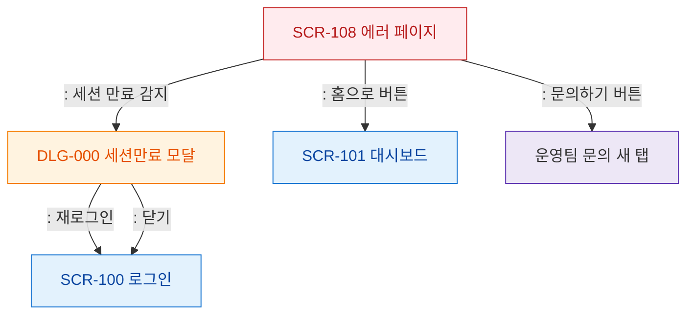

# F5 모달 트리거 트리 — SCR-108 에러 페이지

## 목적
에러 페이지에서 발생하는 모달은 최소화되며, 세션 만료 감지 시에만 DLG-000이 트리거된다.

## 다이어그램

## TC 후보

| TC ID | 타입 | Given | When | Then | |-------|------|-------|------|------| | TC-108-F5-01 | negative | manager | 에러 페이지에서 세션 만료 | DLG-000 세션만료 모달 | | TC-108-F5-02 | positive | manager | 홈으로 버튼 | 대시보드 이동 |
