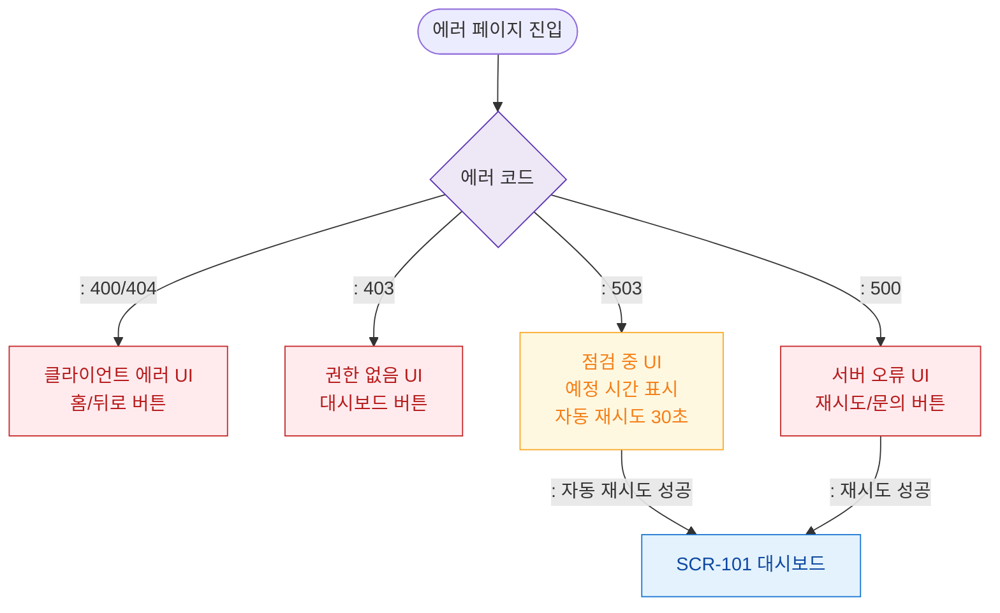

# F6 상태별 화면 플로우 — SCR-108 에러 페이지

## 목적
에러 코드별 UI 상태와 503 서비스 점검 자동 재시도 흐름을 정의한다.

## 다이어그램

## TC 후보

| TC ID | 타입 | Given | When | Then | |-------|------|-------|------|------| | TC-108-F6-01 | negative | manager | 403 에러 | 권한 없음 UI + 대시보드 버튼 | | TC-108-F6-02 | negative | manager | 500 에러 | 서버 오류 UI + 재시도/문의 버튼 | | TC-108-F6-03 | negative | manager | 503 에러 | 점검 중 UI + 자동 재시도 |
