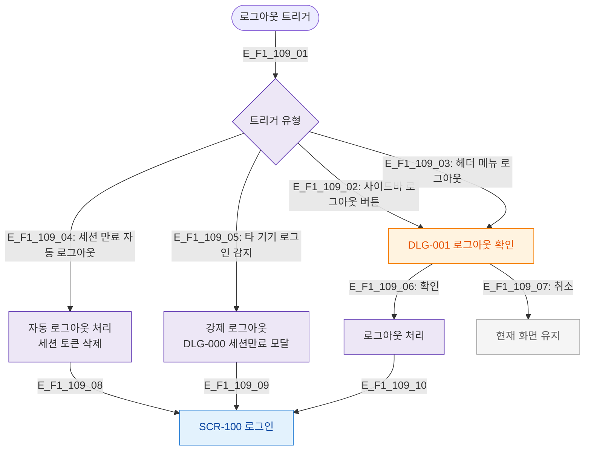

# F1 진입 플로우 — SCR-109 로그아웃

## 목적
로그아웃 트리거 경로(사이드바/헤더/세션만료 자동)와 확인 모달 흐름을 정의한다.

## 다이어그램

## TC 후보

| TC ID | 타입 | Given | When | Then |
|-------|------|-------|------|------|
| TC-109-F1-01 | positive | manager | 사이드바 로그아웃 버튼 | DLG-001 확인 모달 |
| TC-109-F1-02 | positive | manager | 로그아웃 확인 | SCR-100 이동 |
| TC-109-F1-03 | positive | manager | 로그아웃 취소 | 현재 화면 유지 |
| TC-109-F1-04 | negative | manager | 세션 만료 자동 로그아웃 | SCR-100 이동 |
