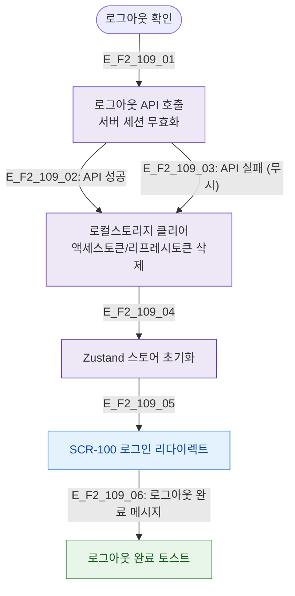

# F2 메인 인터랙션 플로우 — SCR-109 로그아웃

## 목적
로그아웃 처리 시 세션 토큰 삭제, 로컬스토리지 클리어, 리다이렉트 흐름을 정의한다.

## 다이어그램

## TC 후보

| TC ID | 타입 | Given | When | Then |
|-------|------|-------|------|------|
| TC-109-F2-01 | positive | manager | 로그아웃 확인 | 세션 토큰 삭제 + SCR-100 이동 |
| TC-109-F2-02 | positive | manager | SCR-100 도달 | 로그아웃 완료 토스트 |
| TC-109-F2-03 | negative | manager | 로그아웃 API 실패 | 강제 클리어 후 SCR-100 이동 |
