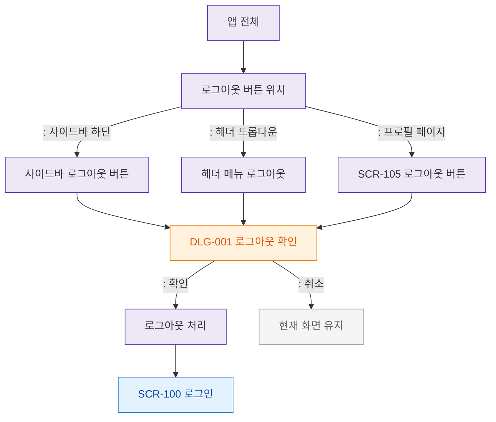

# F3 버튼/액션 플로우 — SCR-109 로그아웃

## 목적
로그아웃 트리거 버튼 위치와 각 버튼의 동작을 정의한다.

## 다이어그램

## TC 후보

| TC ID | 타입 | Given | When | Then | |-------|------|-------|------|------| | TC-109-F3-01 | positive | manager | 사이드바 로그아웃 버튼 | DLG-001 열림 | | TC-109-F3-02 | positive | manager | 헤더 메뉴 로그아웃 | DLG-001 열림 | | TC-109-F3-03 | positive | manager | 로그아웃 확인 | SCR-100 이동 |
