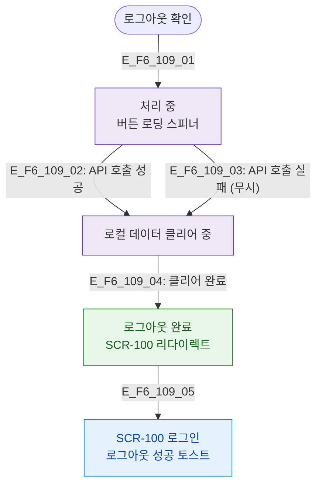

# F6 상태별 화면 플로우 — SCR-109 로그아웃

## 목적
로그아웃 처리 중/완료/실패 상태별 UI 분기를 정의한다.

## 다이어그램

## TC 후보

| TC ID | 타입 | Given | When | Then |
|-------|------|-------|------|------|
| TC-109-F6-01 | positive | manager | 로그아웃 확인 | 처리 중 스피너 표시 |
| TC-109-F6-02 | positive | manager | 처리 완료 | SCR-100 이동 + 완료 토스트 |
| TC-109-F6-03 | negative | manager | API 실패 | 강제 클리어 후 SCR-100 이동 |
