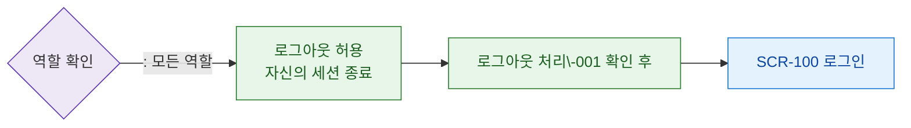

# F7 권한(RBAC) 분기 플로우 — SCR-109 로그아웃

## 목적
로그아웃은 모든 역할이 수행 가능하다. 역할별 차이는 없다.

## 다이어그램

## TC 후보

| TC ID | 타입 | Given | When | Then | |-------|------|-------|------|------| | TC-109-F7-01 | positive | staff | 로그아웃 버튼 | 허용 + DLG-001 표시 | | TC-109-F7-02 | positive | | 로그아웃 버튼 | 허용 + DLG-001 표시 |
