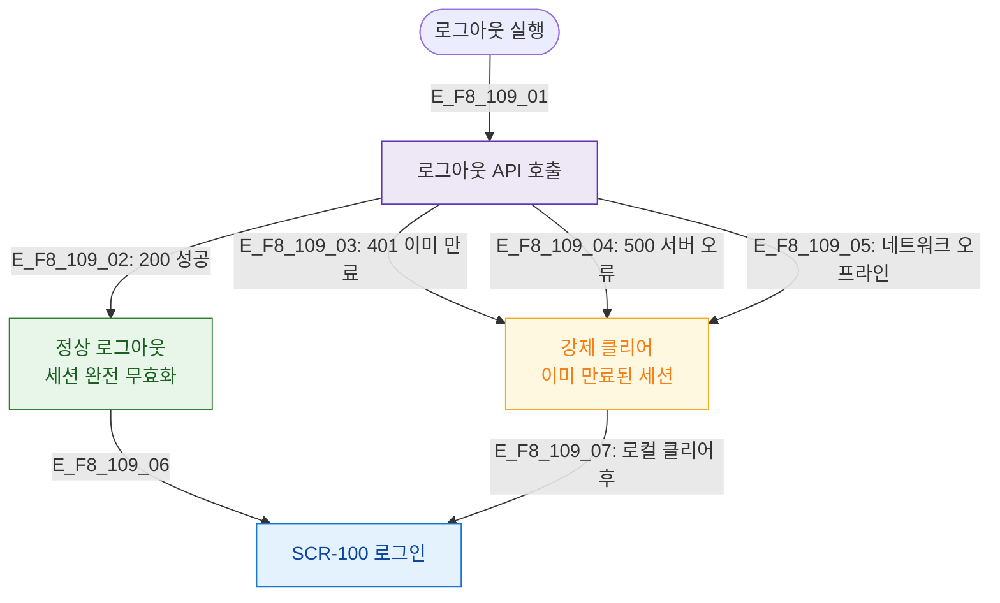

# F8 에러/예외/복구 플로우 — SCR-109 로그아웃

## 목적
로그아웃 API 실패 시 클라이언트 강제 클리어로 복구하는 흐름을 정의한다.

## 다이어그램

## TC 후보

| TC ID | 타입 | Given | When | Then |
|-------|------|-------|------|------|
| TC-109-F8-01 | positive | manager | 로그아웃 API 성공 | 정상 종료 + SCR-100 |
| TC-109-F8-02 | negative | manager | 로그아웃 API 500 오류 | 강제 클리어 후 SCR-100 |
| TC-109-F8-03 | negative | manager | 네트워크 오프라인 | 강제 클리어 후 SCR-100 |
