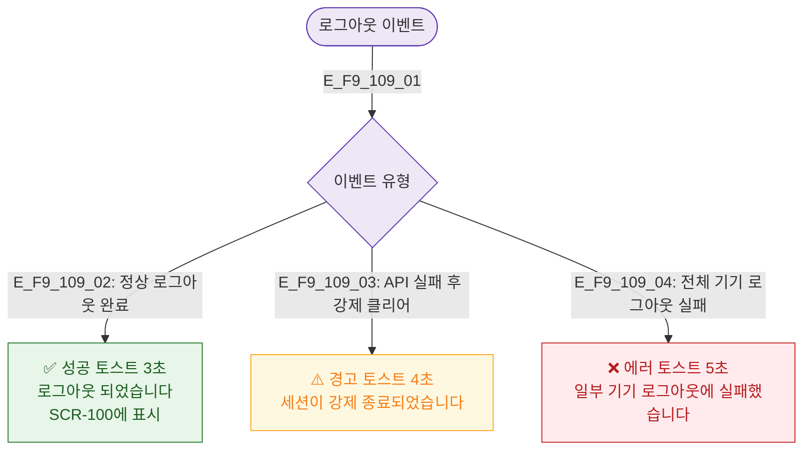

# F9 토스트/피드백 플로우 — SCR-109 로그아웃

## 목적
로그아웃 성공/에러 토스트 발생 조건과 메시지를 정의한다.

## 다이어그램

## TC 후보

| TC ID | 타입 | Given | When | Then |
|-------|------|-------|------|------|
| TC-109-F9-01 | positive | manager | 로그아웃 완료 | SCR-100에서 성공 토스트 3초 |
| TC-109-F9-02 | negative | manager | API 실패 강제 클리어 | 경고 토스트 4초 |
| TC-109-F9-03 | negative | manager | 전체 기기 로그아웃 실패 | 에러 토스트 5초 |
