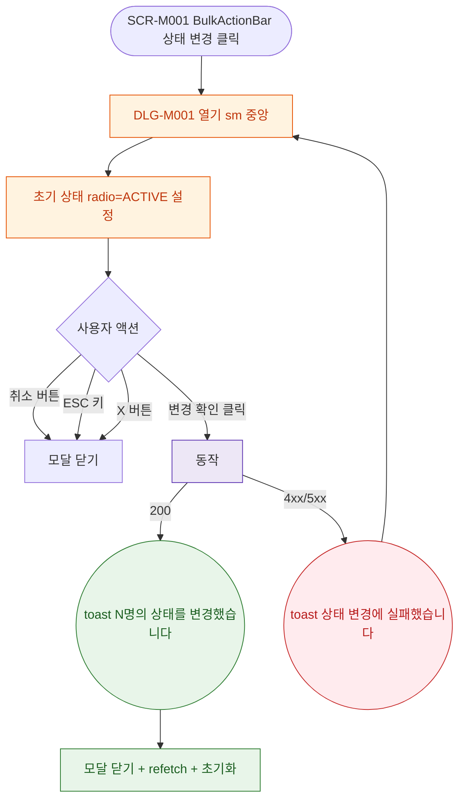

## 1. 목적

DLG-M001 상태 일괄 변경 다이얼로그의 열기/닫기/완료 생명주기를 명세한다.

## 2. 트리거/전제조건

- SCR-M001 BulkActionBar > "상태 변경" 버튼 클릭
-

## 3. 다이어그램

## 4. 엣지 설명

| 출발 | 도착 | 조건 | |---------|------|------|------| | | 버튼 클릭 | 모달 열기 | |
| 취소 버튼 | 모달 닫기 | - | | | ESC 키 | 모달 닫기 | - | | | 변경 확인 | API 호출 | - | | | API | toast | 200 | | | API | toast | 4xx/5xx |
