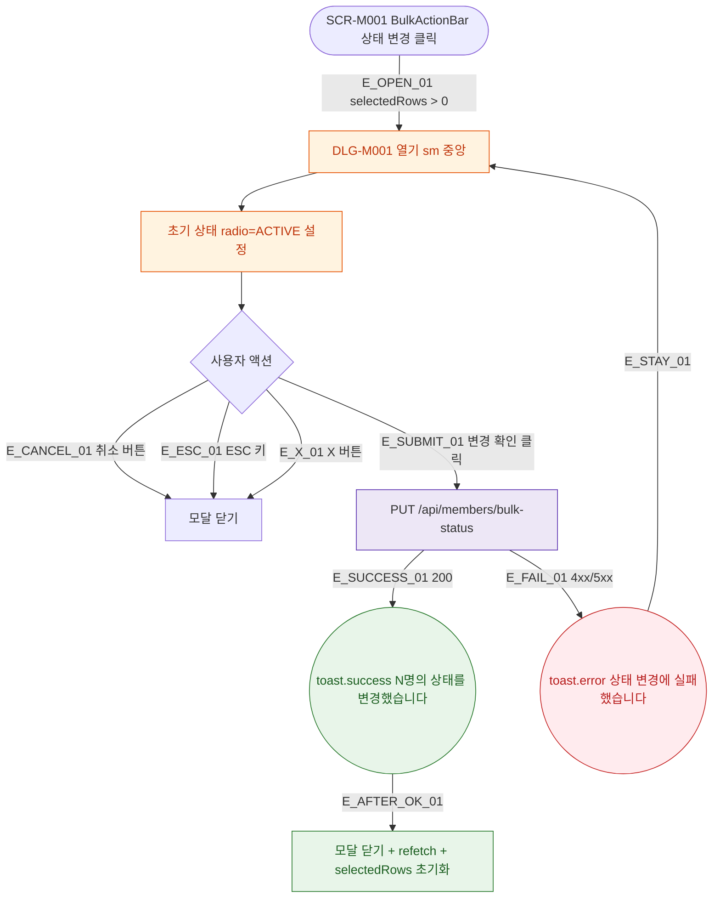

## 1. 목적

DLG-M001 상태 일괄 변경 다이얼로그의 열기/닫기/완료 생명주기를 명세한다.

## 2. 트리거/전제조건

- SCR-M001 BulkActionBar > "상태 변경" 버튼 클릭
- selectedRows.size > 0

## 3. 다이어그램

## 4. 엣지 설명

| 엣지 ID | 출발 | 도착 | 조건 |
|---------|------|------|------|
| E_OPEN_01 | 버튼 클릭 | 모달 열기 | selectedRows > 0 |
| E_CANCEL_01 | 취소 버튼 | 모달 닫기 | - |
| E_ESC_01 | ESC 키 | 모달 닫기 | - |
| E_SUBMIT_01 | 변경 확인 | API 호출 | - |
| E_SUCCESS_01 | API | toast.success | 200 |
| E_FAIL_01 | API | toast.error | 4xx/5xx |

## 5. TC 후보

| TC ID | 타입 | Given | When | Then |
|-------|------|-------|------|------|
| TC-DLG-M001-M1-01 | positive | 2명 선택 | 상태 변경 클릭 | 모달 열림, radio=ACTIVE |
| TC-DLG-M001-M1-02 | positive | 모달 열림 | ESC 키 | 모달 닫힘 |
| TC-DLG-M001-M1-03 | positive | 변경 확인 | API 200 | toast.success, 목록 갱신 |
| TC-DLG-M001-M1-04 | exception | 변경 확인 | API 500 | toast.error, 모달 유지 |
