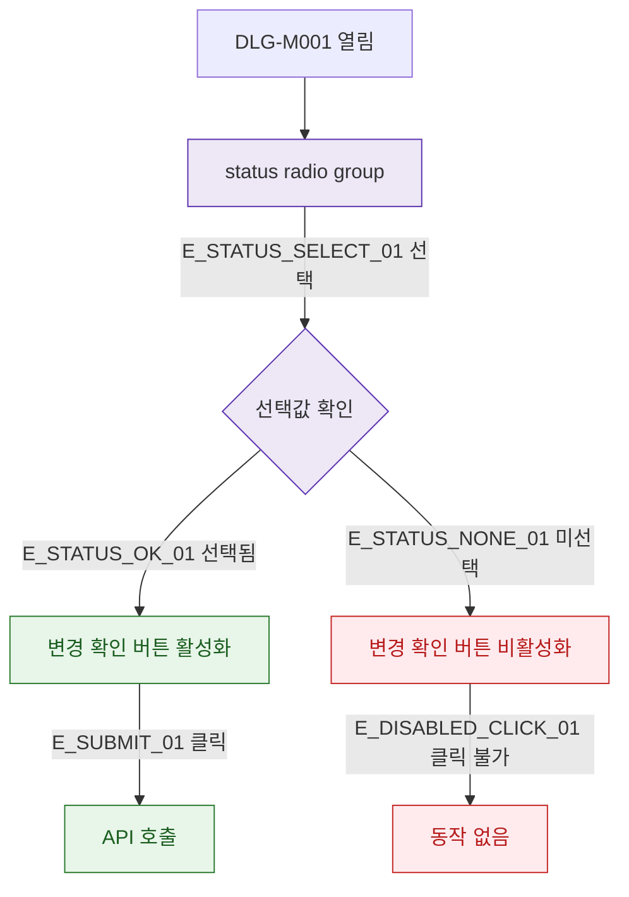

## 1. 목적

DLG-M001의 필드 유효성 검증 흐름을 명세한다.

## 2. 트리거/전제조건

- DLG-M001 열린 상태

## 3. 다이어그램

## 4. 엣지 설명

| 엣지 ID | 출발 | 도착 | 조건 |
|---------|------|------|------|
| E_STATUS_SELECT_01 | radio group | 선택값 확인 | 사용자 선택 |
| E_STATUS_OK_01 | 선택값 확인 | 버튼 활성화 | 선택됨 |
| E_STATUS_NONE_01 | 선택값 확인 | 버튼 비활성 | 미선택 |
| E_SUBMIT_01 | 버튼 활성 | API 호출 | 클릭 |

## 5. TC 후보

| TC ID | 타입 | Given | When | Then |
|-------|------|-------|------|------|
| TC-DLG-M001-M2-01 | positive | 모달 열림 | ACTIVE 선택 | 버튼 활성화 |
| TC-DLG-M001-M2-02 | positive | 모달 열림 | HOLDING 선택 | 버튼 활성화 |
| TC-DLG-M001-M2-03 | negative | 기본값 ACTIVE | 변경 없이 클릭 | 기본값으로 API 호출 |
