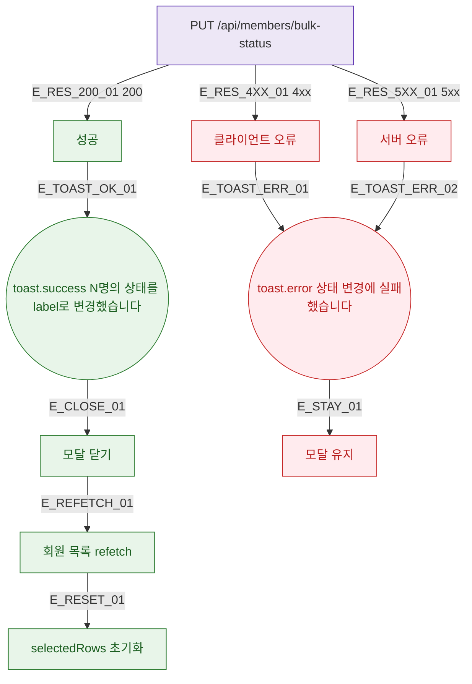

## 1. 목적

DLG-M001 API 응답별 결과 분기와 후속 동작을 명세한다.

## 2. 트리거/전제조건

- PUT /api/members/bulk-status 호출 후

## 3. 다이어그램

## 4. 엣지 설명

| 엣지 ID | 출발 | 도착 | 조건 |
|---------|------|------|------|
| E_RES_200_01 | API | 성공 | 200 |
| E_RES_4XX_01 | API | 클라이언트 오류 | 4xx |
| E_RES_5XX_01 | API | 서버 오류 | 5xx |
| E_TOAST_OK_01 | 성공 | toast.success | - |
| E_CLOSE_01 | toast.success | 모달 닫기 | - |
| E_REFETCH_01 | 모달 닫기 | 목록 갱신 | - |

## 5. TC 후보

| TC ID | 타입 | Given | When | Then |
|-------|------|-------|------|------|
| TC-DLG-M001-M3-01 | positive | API 200 | 변경 확인 | toast.success + 닫힘 + 갱신 |
| TC-DLG-M001-M3-02 | exception | API 500 | 변경 확인 | toast.error + 모달 유지 |
| TC-DLG-M001-M3-03 | positive | 성공 후 | - | selectedRows 초기화 확인 |
