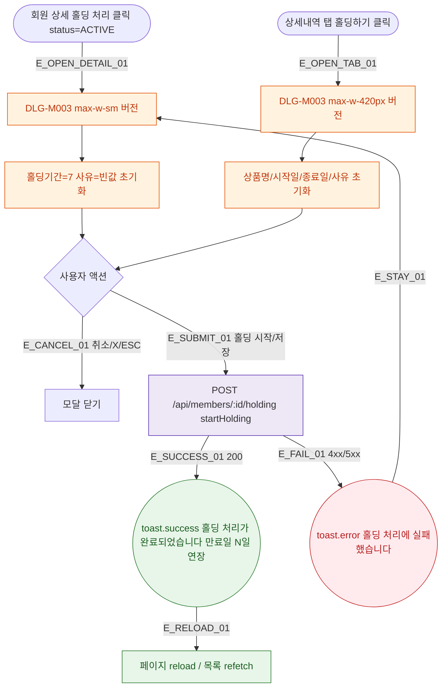

## 1. 목적

DLG-M003 홀딩 등록 다이얼로그의 열기/닫기/완료 생명주기를 명세한다.

## 2. 트리거/전제조건

- 회원 상세 > 상태 관리 > "홀딩 처리" (status==='ACTIVE')
- 또는 상세내역 탭 > 홀딩 서브탭 > "홀딩하기"

## 3. 다이어그램

## 4. 엣지 설명

| 엣지 ID | 출발 | 도착 | 조건 |
|---------|------|------|------|
| E_OPEN_DETAIL_01 | 홀딩 처리 버튼 | 모달(상세) | status=ACTIVE |
| E_OPEN_TAB_01 | 홀딩하기 버튼 | 모달(탭) | - |
| E_SUBMIT_01 | 홀딩 시작 | API | 필수 충족 |
| E_SUCCESS_01 | API | toast.success | 200 |
| E_FAIL_01 | API | toast.error | 오류 |

## 5. TC 후보

| TC ID | 타입 | Given | When | Then |
|-------|------|-------|------|------|
| TC-DLG-M003-M1-01 | positive | ACTIVE 회원 | 홀딩 처리 클릭 | 모달 열림 기간=7 |
| TC-DLG-M003-M1-02 | positive | API 200 | 홀딩 시작 | toast.success + 갱신 |
| TC-DLG-M003-M1-03 | exception | API 500 | 홀딩 시작 | toast.error, 모달 유지 |
| TC-DLG-M003-M1-04 | positive | 모달 열림 | ESC | 모달 닫힘 |
