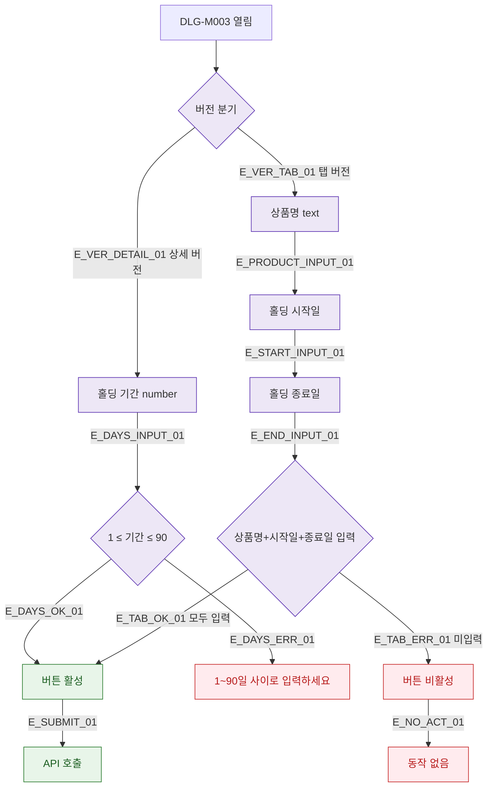

## 1. 목적

DLG-M003의 필드별 유효성 검증 흐름을 명세한다.

## 2. 트리거/전제조건

- DLG-M003 열린 상태

## 3. 다이어그램

## 4. 엣지 설명

| 엣지 ID | 출발 | 도착 | 조건 |
|---------|------|------|------|
| E_DAYS_OK_01 | 기간 검증 | 버튼 활성 | 1~90 범위 |
| E_DAYS_ERR_01 | 기간 검증 | 에러 메시지 | 범위 초과 |
| E_TAB_OK_01 | 탭 검증 | 버튼 활성 | 필수 모두 입력 |
| E_TAB_ERR_01 | 탭 검증 | 버튼 비활성 | 미입력 |

## 5. TC 후보

| TC ID | 타입 | Given | When | Then |
|-------|------|-------|------|------|
| TC-DLG-M003-M2-01 | positive | 기간=7 | 입력 | 버튼 활성 |
| TC-DLG-M003-M2-02 | negative | 기간=0 | 입력 | 에러 메시지 |
| TC-DLG-M003-M2-03 | negative | 기간=91 | 입력 | 에러 메시지 |
| TC-DLG-M003-M2-04 | positive | 탭버전 필수 모두 입력 | - | 버튼 활성 |
| TC-DLG-M003-M2-05 | negative | 탭버전 종료일 미입력 | - | 버튼 비활성 |
