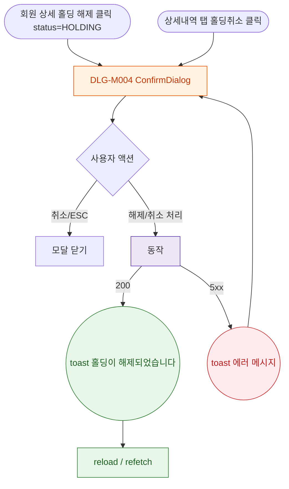

## 1. 목적

DLG-M004 홀딩 해제 다이얼로그의 열기/닫기/완료 생명주기를 명세한다.

## 2. 트리거/전제조건

- 회원 상세 > "홀딩 해제" (status==='HOLDING')
- 또는 상세내역 탭 > 홀딩 행 > "홀딩취소"

## 3. 다이어그램

## 4. 엣지 설명

| 출발 | 도착 | 조건 | |---------|------|------|------| | | 홀딩 해제 버튼 | 모달 | status=HOLDING | | | 취소/ESC | 모달 닫기 | - | | | 해제 처리 | API | 확인 클릭 | | | API | toast | 200 | | | API | toast | 5xx |
