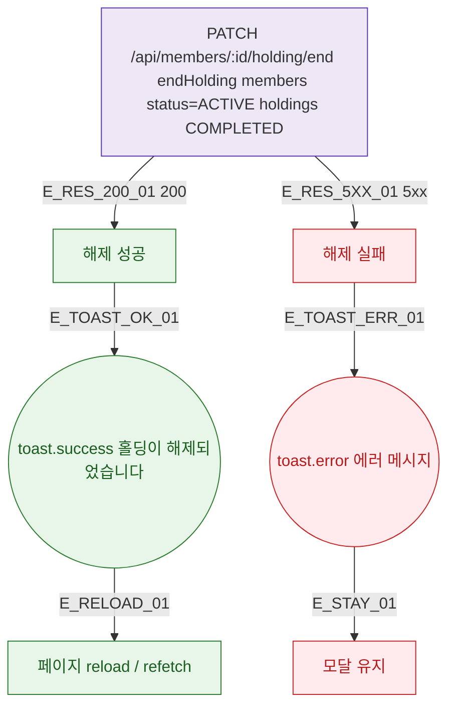

## 1. 목적

DLG-M004 홀딩 해제 API 응답별 결과 분기를 명세한다.

## 2. 트리거/전제조건

- PATCH /api/members/:id/holding/end 호출 후

## 3. 다이어그램

## 4. 엣지 설명

| 엣지 ID | 출발 | 도착 | 조건 |
|---------|------|------|------|
| E_RES_200_01 | API | 성공 | 200 |
| E_RES_5XX_01 | API | 실패 | 5xx |
| E_TOAST_OK_01 | 성공 | toast.success | - |
| E_RELOAD_01 | toast | 페이지 갱신 | - |

## 5. TC 후보

| TC ID | 타입 | Given | When | Then |
|-------|------|-------|------|------|
| TC-DLG-M004-M3-01 | positive | API 200 | 해제 처리 | toast.success + 상태 ACTIVE 갱신 |
| TC-DLG-M004-M3-02 | exception | API 500 | 해제 처리 | toast.error + 모달 유지 |
