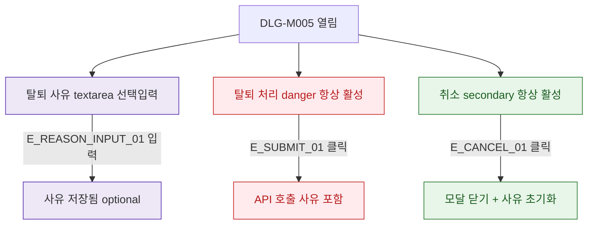

## 1. 목적

DLG-M005의 필드 검증 흐름을 명세한다. 탈퇴 사유는 선택 입력이므로 버튼 disabled 조건 없음.

## 2. 트리거/전제조건

- DLG-M005 열린 상태

## 3. 다이어그램

## 4. 엣지 설명

| 엣지 ID | 출발 | 도착 | 조건 |
|---------|------|------|------|
| E_REASON_INPUT_01 | textarea | 사유 저장 | 입력 (선택) |
| E_SUBMIT_01 | 탈퇴 처리 | API | 클릭 (사유 유무 무관) |
| E_CANCEL_01 | 취소 | 닫기+초기화 | 클릭 |

## 5. TC 후보

| TC ID | 타입 | Given | When | Then |
|-------|------|-------|------|------|
| TC-DLG-M005-M2-01 | positive | 사유 미입력 | 탈퇴 처리 클릭 | API 호출 (사유 빈값) |
| TC-DLG-M005-M2-02 | positive | 사유 입력 | 탈퇴 처리 클릭 | API 호출 (사유 포함) |
| TC-DLG-M005-M2-03 | positive | 사유 입력 후 | 취소 클릭 | 사유 초기화 확인 |
