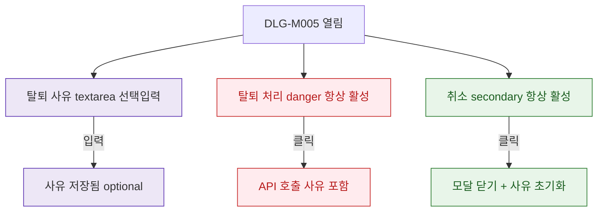

## 1. 목적

DLG-M005의 필드 검증 흐름을 명세한다. 탈퇴 사유는 선택 입력이므로 버튼 disabled 조건 없음.

## 2. 트리거/전제조건

- DLG-M005 열린 상태

## 3. 다이어그램

## 4. 엣지 설명

| 출발 | 도착 | 조건 | |---------|------|------|------| | | textarea | 사유 저장 | 입력 (선택) | | | 탈퇴 처리 | API | 클릭 (사유 유무 무관) | | | 취소 | 닫기+초기화 | 클릭 |
