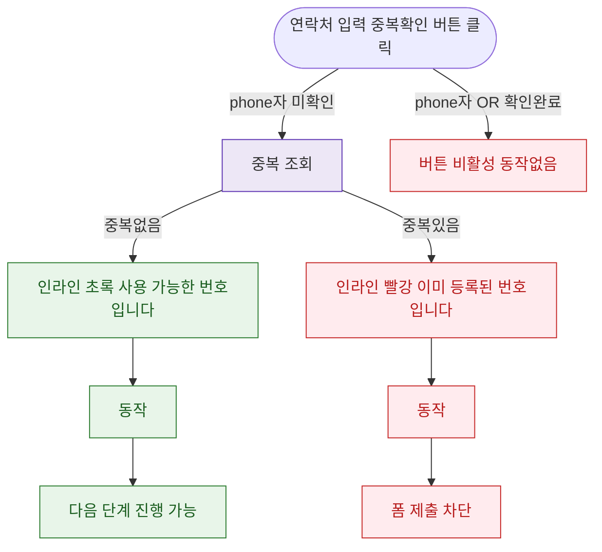

## 1. 목적

DLG-M006 전화번호 중복 확인(인라인)의 트리거/결과 생명주기를 명세한다.

## 2. 트리거/전제조건

- 회원 등록/수정 > 연락처 필드 입력 후 "중복확인" 버튼 클릭
- phone AND 

## 3. 다이어그램

## 4. 엣지 설명

| 출발 | 도착 | 조건 | |---------|------|------|------| | | 중복확인 버튼 | API | phone AND 미확인 | | | 중복확인 버튼 | 비활성 | phone OR 확인완료 | | | API | 인라인 초록 | 중복 없음 | | | API | 인라인 빨강 | 중복 있음 |
