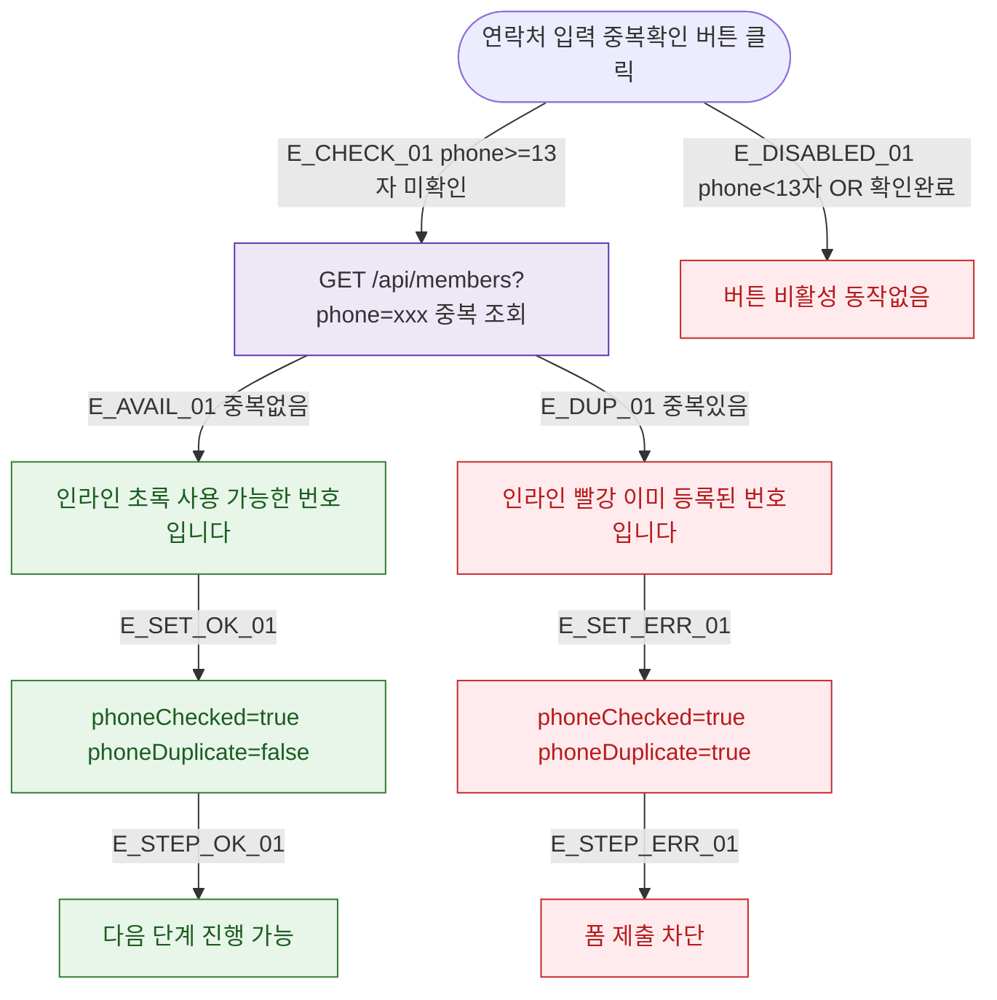

## 1. 목적

DLG-M006 전화번호 중복 확인(인라인)의 트리거/결과 생명주기를 명세한다.

## 2. 트리거/전제조건

- 회원 등록/수정 > 연락처 필드 입력 후 "중복확인" 버튼 클릭
- phone.length >= 13 AND phoneChecked === false

## 3. 다이어그램

## 4. 엣지 설명

| 엣지 ID | 출발 | 도착 | 조건 |
|---------|------|------|------|
| E_CHECK_01 | 중복확인 버튼 | API | phone>=13 AND 미확인 |
| E_DISABLED_01 | 중복확인 버튼 | 비활성 | phone<13 OR 확인완료 |
| E_AVAIL_01 | API | 인라인 초록 | 중복 없음 |
| E_DUP_01 | API | 인라인 빨강 | 중복 있음 |

## 5. TC 후보

| TC ID | 타입 | Given | When | Then |
|-------|------|-------|------|------|
| TC-DLG-M006-M1-01 | positive | 미등록 번호 | 중복확인 | 인라인 초록, 진행 가능 |
| TC-DLG-M006-M1-02 | negative | 등록된 번호 | 중복확인 | 인라인 빨강, 제출 차단 |
| TC-DLG-M006-M1-03 | positive | 수정 모드 자기 번호 | 중복확인 | 자기 제외 조회, 사용 가능 |
| TC-DLG-M006-M1-04 | negative | phone 12자 | 중복확인 클릭 | 버튼 비활성 |
