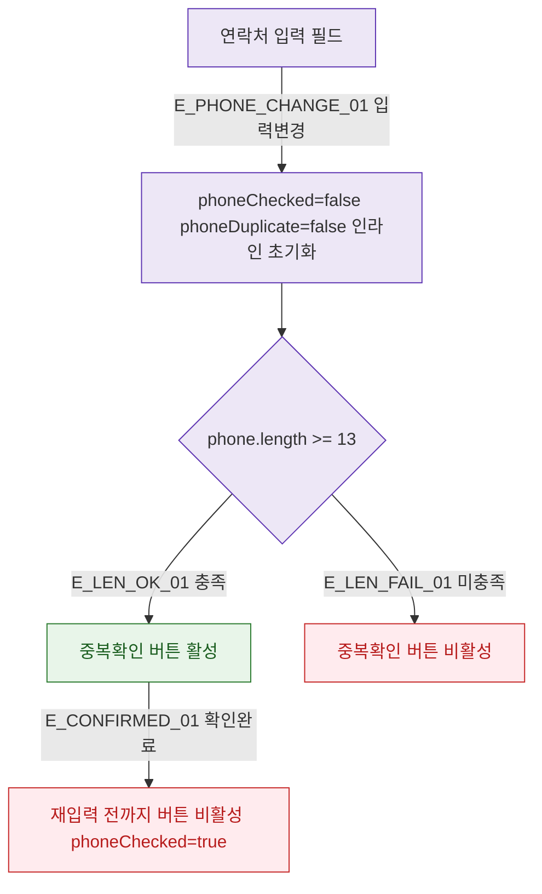

## 1. 목적

DLG-M006 중복확인 버튼 활성화 조건과 인라인 결과 표시 검증을 명세한다.

## 2. 트리거/전제조건

- 연락처 필드 입력 중

## 3. 다이어그램

## 4. 엣지 설명

| 엣지 ID | 출발 | 도착 | 조건 |
|---------|------|------|------|
| E_PHONE_CHANGE_01 | 연락처 변경 | 상태 초기화 | 입력 변경 시 |
| E_LEN_OK_01 | 길이 확인 | 버튼 활성 | 13자 이상 |
| E_LEN_FAIL_01 | 길이 확인 | 버튼 비활성 | 13자 미만 |
| E_CONFIRMED_01 | 확인 완료 | 버튼 비활성 | phoneChecked=true |

## 5. TC 후보

| TC ID | 타입 | Given | When | Then |
|-------|------|-------|------|------|
| TC-DLG-M006-M2-01 | positive | 010-1234-5678 (13자) | 입력 | 버튼 활성 |
| TC-DLG-M006-M2-02 | negative | 010-1234 (8자) | 입력 | 버튼 비활성 |
| TC-DLG-M006-M2-03 | positive | 확인 완료 후 번호 변경 | 입력 | 버튼 재활성, 인라인 초기화 |
