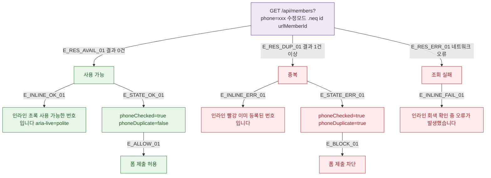

## 1. 목적

DLG-M006 중복 확인 API 응답별 인라인 결과 분기를 명세한다.

## 2. 트리거/전제조건

- GET /api/members?phone=xxx 호출 후

## 3. 다이어그램

## 4. 엣지 설명

| 엣지 ID | 출발 | 도착 | 조건 |
|---------|------|------|------|
| E_RES_AVAIL_01 | API | 사용 가능 | 결과 0건 |
| E_RES_DUP_01 | API | 중복 | 결과 1건+ |
| E_RES_ERR_01 | API | 조회 실패 | 네트워크 오류 |
| E_INLINE_OK_01 | 사용 가능 | 인라인 초록 | - |
| E_INLINE_ERR_01 | 중복 | 인라인 빨강 | - |

## 5. TC 후보

| TC ID | 타입 | Given | When | Then |
|-------|------|-------|------|------|
| TC-DLG-M006-M3-01 | positive | 미등록 번호 | 조회 | 인라인 초록, 제출 허용 |
| TC-DLG-M006-M3-02 | negative | 등록된 번호 | 조회 | 인라인 빨강, 제출 차단 |
| TC-DLG-M006-M3-03 | exception | 네트워크 오류 | 조회 | 인라인 오류 안내 |
