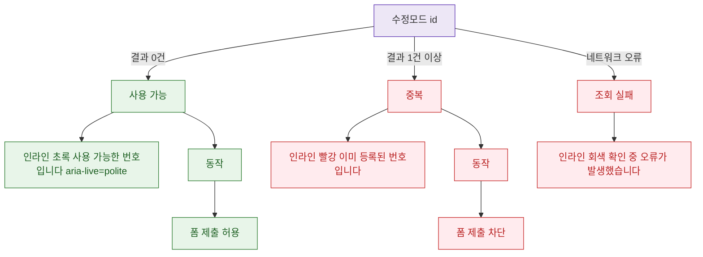

## 1. 목적

DLG-M006 중복 확인 API 응답별 인라인 결과 분기를 명세한다.

## 2. 트리거/전제조건

- 호출 후

## 3. 다이어그램

## 4. 엣지 설명

| 출발 | 도착 | 조건 | |---------|------|------|------| | | API | 사용 가능 | 결과 0건 | | | API | 중복 | 결과 1건+ | | | API | 조회 실패 | 네트워크 오류 | | | 사용 가능 | 인라인 초록 | - | | | 중복 | 인라인 빨강 | - |
