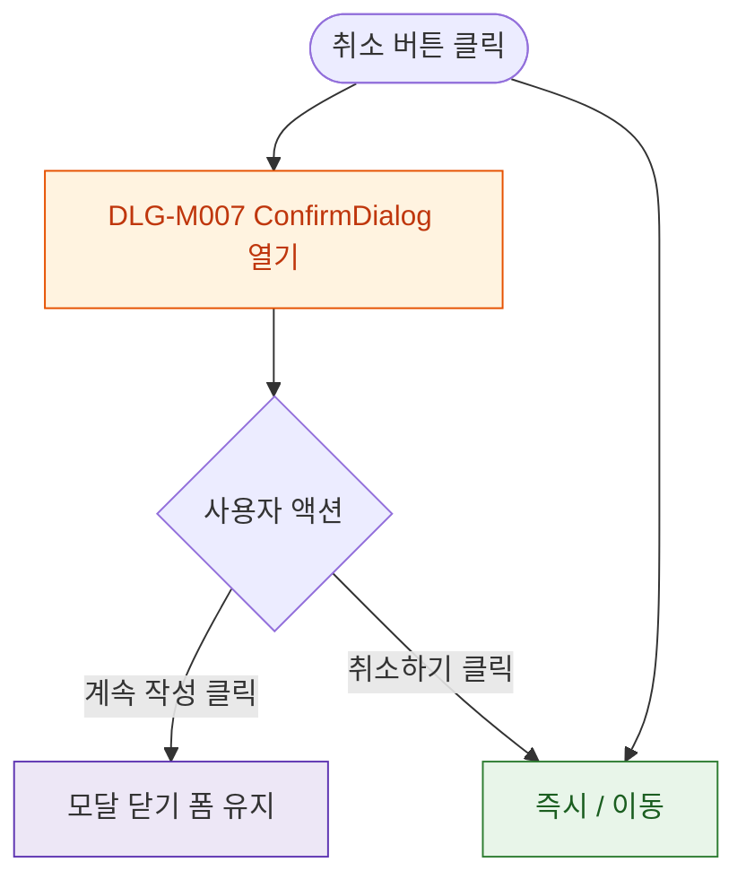

## 1. 목적

DLG-M007 작성 취소 확인 다이얼로그의 열기/닫기/완료 생명주기를 명세한다.

## 2. 트리거/전제조건

- 회원 등록/수정 > "취소" 버튼 클릭
- (폼 변경사항 존재)

## 3. 다이어그램

## 4. 엣지 설명

| 출발 | 도착 | 조건 | |---------|------|------|------| | | 취소 클릭 | 모달 열기 | |
| 취소 클릭 | / 이동 | |
| 계속 작성 | 모달 닫기 | - | | | 취소하기 | / 이동 | - |
