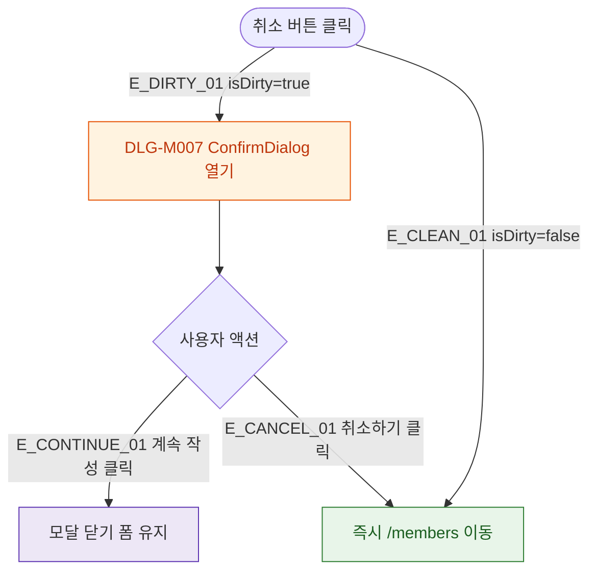

## 1. 목적

DLG-M007 작성 취소 확인 다이얼로그의 열기/닫기/완료 생명주기를 명세한다.

## 2. 트리거/전제조건

- 회원 등록/수정 > "취소" 버튼 클릭
- isDirty === true (폼 변경사항 존재)

## 3. 다이어그램

## 4. 엣지 설명

| 엣지 ID | 출발 | 도착 | 조건 |
|---------|------|------|------|
| E_DIRTY_01 | 취소 클릭 | 모달 열기 | isDirty=true |
| E_CLEAN_01 | 취소 클릭 | /members 이동 | isDirty=false |
| E_CONTINUE_01 | 계속 작성 | 모달 닫기 | - |
| E_CANCEL_01 | 취소하기 | /members 이동 | - |

## 5. TC 후보

| TC ID | 타입 | Given | When | Then |
|-------|------|-------|------|------|
| TC-DLG-M007-M1-01 | positive | isDirty=true | 취소 클릭 | 모달 열림 |
| TC-DLG-M007-M1-02 | positive | isDirty=false | 취소 클릭 | 즉시 /members 이동 |
| TC-DLG-M007-M1-03 | positive | 모달 열림 | 계속 작성 | 모달 닫힘, 폼 유지 |
| TC-DLG-M007-M1-04 | positive | 모달 열림 | 취소하기 | /members 이동 |
