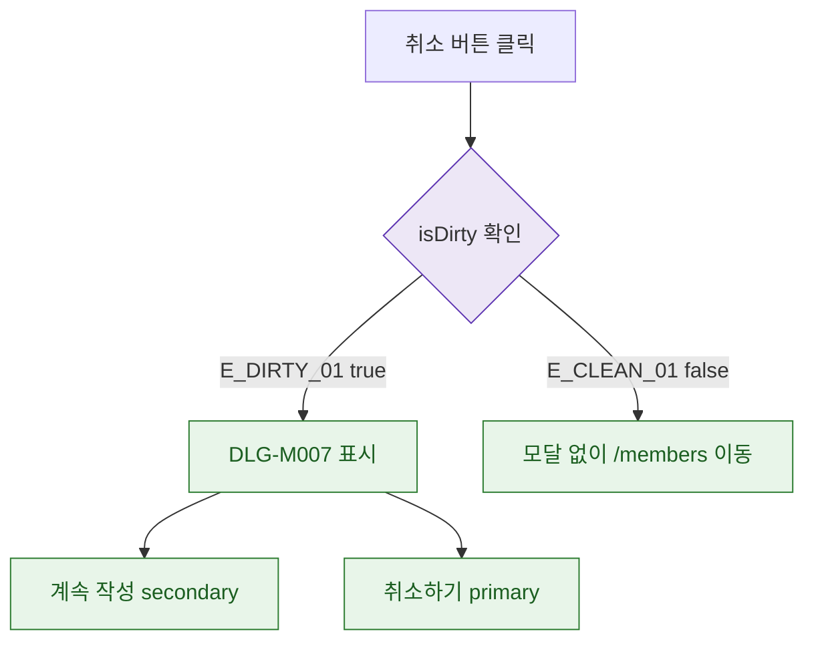

## 1. 목적

DLG-M007은 입력 필드 없는 ConfirmDialog이므로 isDirty 조건만 명세한다.

## 2. 트리거/전제조건

- 취소 버튼 클릭 시점

## 3. 다이어그램

## 4. 엣지 설명

| 엣지 ID | 출발 | 도착 | 조건 |
|---------|------|------|------|
| E_DIRTY_01 | isDirty 확인 | 모달 표시 | true |
| E_CLEAN_01 | isDirty 확인 | /members 이동 | false |

## 5. TC 후보

| TC ID | 타입 | Given | When | Then |
|-------|------|-------|------|------|
| TC-DLG-M007-M2-01 | positive | 이름 입력 후 | 취소 클릭 | isDirty=true → 모달 표시 |
| TC-DLG-M007-M2-02 | positive | 아무것도 안입력 | 취소 클릭 | isDirty=false → 즉시 이동 |
