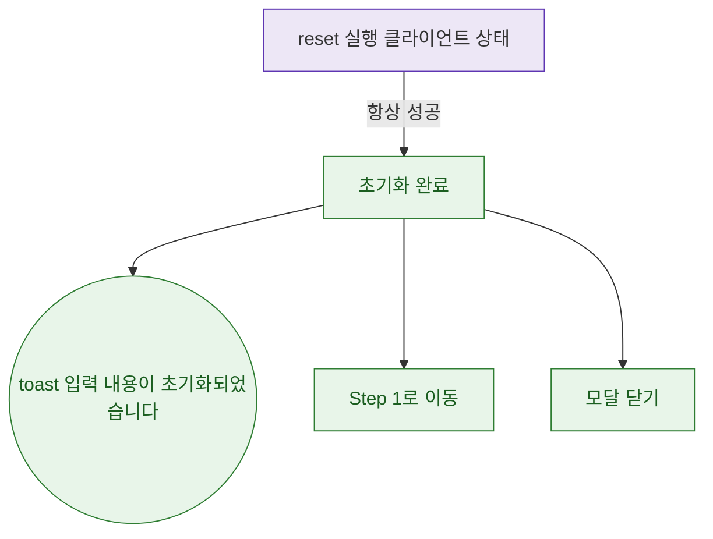

## 1. 목적

DLG-M008 초기화 실행 후 결과 분기를 명세한다. API 호출 없음 (클라이언트 상태 초기화).

## 2. 트리거/전제조건

- 초기화 버튼 클릭 후

## 3. 다이어그램

## 4. 엣지 설명

| 출발 | 도착 | 조건 | |---------|------|------|------| | | reset | 완료 | 항상 성공 (클라이언트) | | | 완료 | toast | - | | | 완료 | Step 1 이동 | - | | | 완료 | 모달 닫기 | - |
