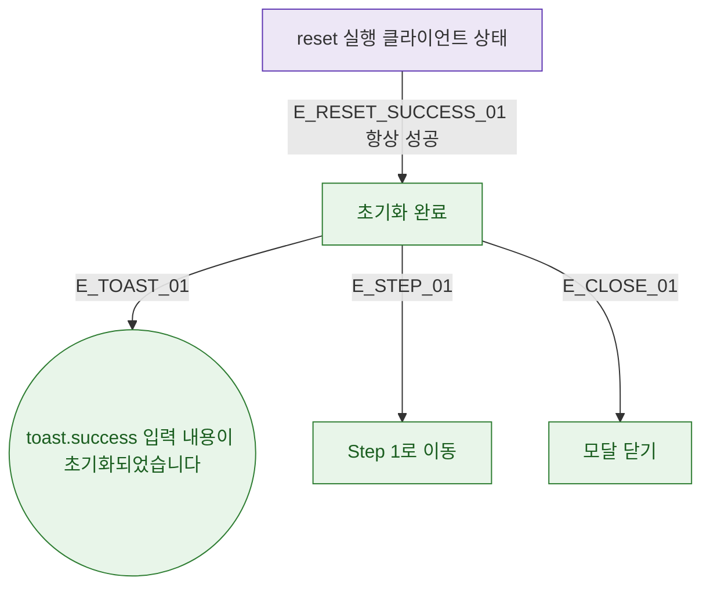

## 1. 목적

DLG-M008 초기화 실행 후 결과 분기를 명세한다. API 호출 없음 (클라이언트 상태 초기화).

## 2. 트리거/전제조건

- 초기화 버튼 클릭 후

## 3. 다이어그램

## 4. 엣지 설명

| 엣지 ID | 출발 | 도착 | 조건 |
|---------|------|------|------|
| E_RESET_SUCCESS_01 | reset | 완료 | 항상 성공 (클라이언트) |
| E_TOAST_01 | 완료 | toast.success | - |
| E_STEP_01 | 완료 | Step 1 이동 | - |
| E_CLOSE_01 | 완료 | 모달 닫기 | - |

## 5. TC 후보

| TC ID | 타입 | Given | When | Then |
|-------|------|-------|------|------|
| TC-DLG-M008-M3-01 | positive | 초기화 확인 | 클릭 | toast.success 표시 |
| TC-DLG-M008-M3-02 | positive | 초기화 확인 | 클릭 | Step 1 이동 확인 |
| TC-DLG-M008-M3-03 | positive | 초기화 확인 | 클릭 | 모달 자동 닫힘 |
