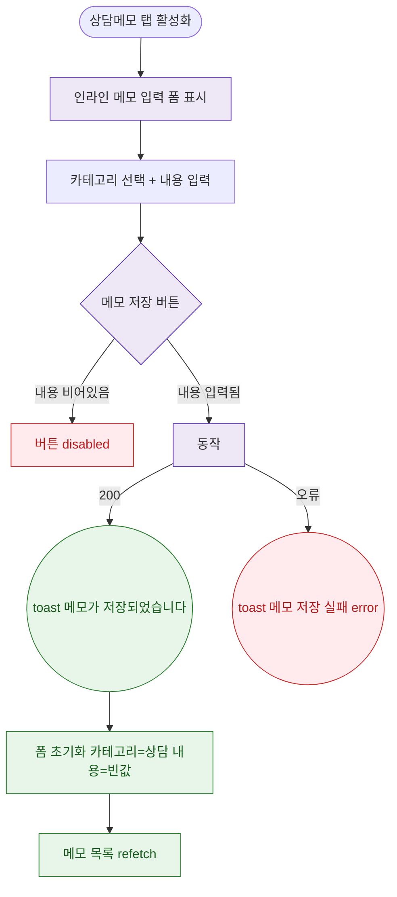

## 1. 목적

DLG-M009 메모 추가 인라인 폼의 트리거/저장/완료 생명주기를 명세한다.

## 2. 트리거/전제조건

- 상담메모 탭 > "메모 저장" 버튼 클릭 (인라인 폼, 모달 아님)

## 3. 다이어그램

## 4. 엣지 설명

| 출발 | 도착 | 조건 | |---------|------|------|------| | | 탭 활성 | 인라인 폼 | - | | | 저장 버튼 | 비활성 | 내용 비어있음 | | | 저장 버튼 | API | 내용 입력됨 | | | API | toast | 200 | | | API | toast | 오류 |
