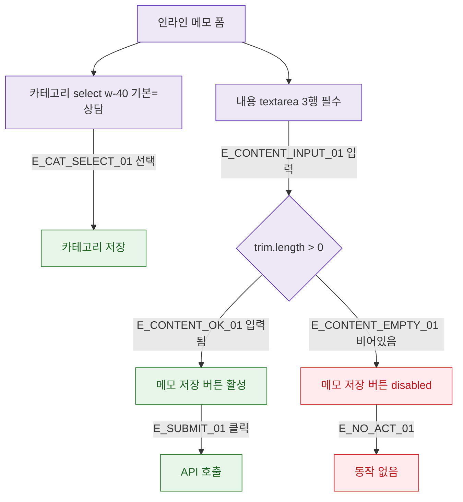

## 1. 목적

DLG-M009 인라인 폼의 필드별 유효성 검증을 명세한다.

## 2. 트리거/전제조건

- 상담메모 탭 인라인 폼 표시 상태

## 3. 다이어그램

## 4. 엣지 설명

| 엣지 ID | 출발 | 도착 | 조건 |
|---------|------|------|------|
| E_CONTENT_OK_01 | 내용 확인 | 버튼 활성 | trim.length > 0 |
| E_CONTENT_EMPTY_01 | 내용 확인 | 버튼 비활성 | 비어있음 |
| E_SUBMIT_01 | 버튼 활성 | API | 클릭 |

## 5. TC 후보

| TC ID | 타입 | Given | When | Then |
|-------|------|-------|------|------|
| TC-DLG-M009-M2-01 | positive | 내용 입력 | 입력 | 버튼 활성 |
| TC-DLG-M009-M2-02 | negative | 공백만 입력 | 입력 | 버튼 비활성 (trim) |
| TC-DLG-M009-M2-03 | positive | 카테고리 변경 | 선택 | 선택값 저장 |
