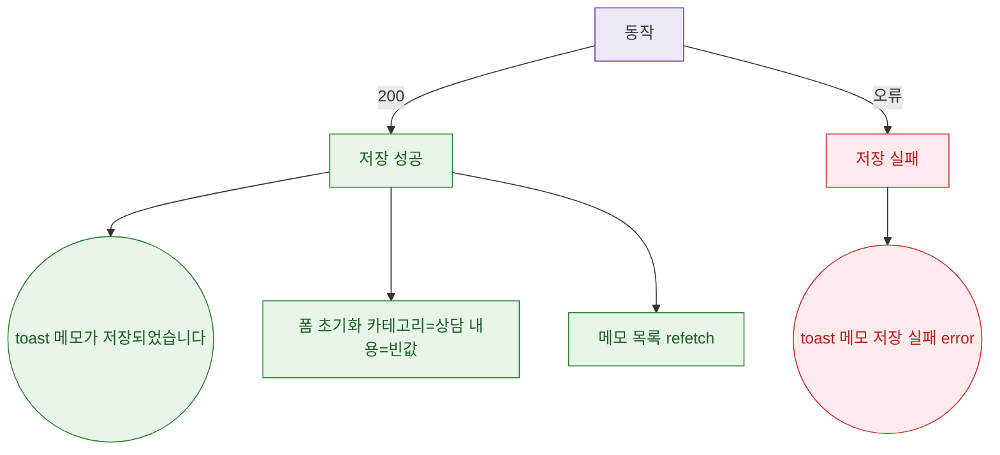

## 1. 목적

DLG-M009 메모 저장 API 응답별 결과 분기를 명세한다.

## 2. 트리거/전제조건

- 호출 후

## 3. 다이어그램

## 4. 엣지 설명

| 출발 | 도착 | 조건 | |---------|------|------|------| | | API | 성공 | 200 | | | API | 실패 | 오류 | | | 성공 | toast | - | | | 성공 | 폼 초기화 | - | | | 성공 | 목록 갱신 | - |
