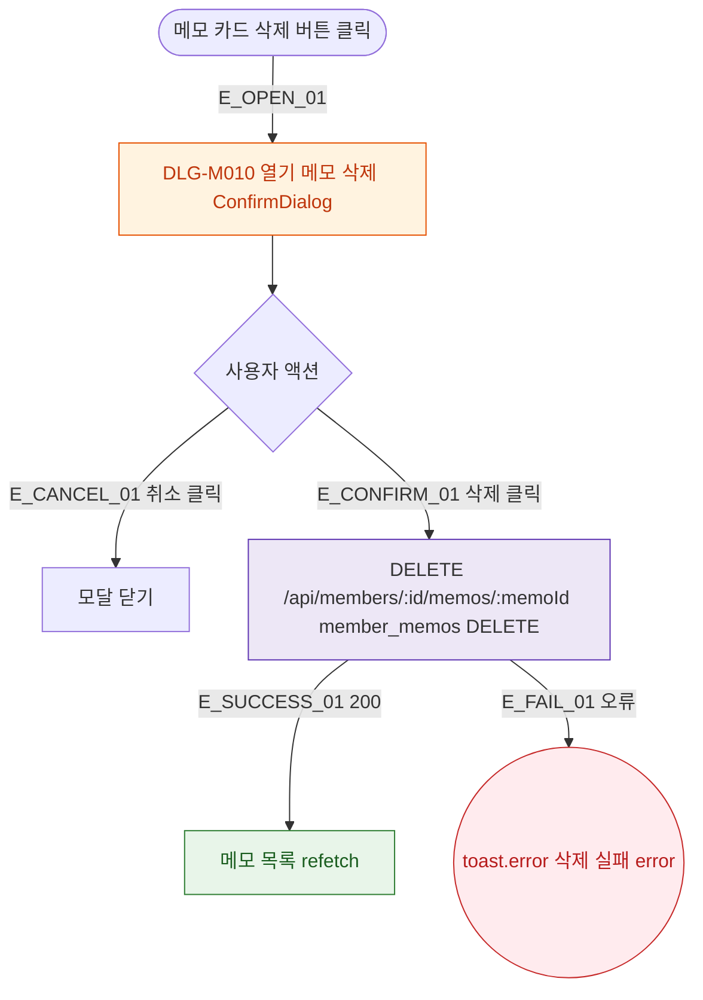

## 1. 목적

DLG-M010 메모 삭제 확인 다이얼로그의 열기/닫기/완료 생명주기를 명세한다.

## 2. 트리거/전제조건

- 상담메모 탭 > 메모 카드 > "삭제" 버튼 클릭

## 3. 다이어그램

## 4. 엣지 설명

| 엣지 ID | 출발 | 도착 | 조건 |
|---------|------|------|------|
| E_OPEN_01 | 삭제 버튼 | 모달 열기 | - |
| E_CANCEL_01 | 취소 | 모달 닫기 | - |
| E_CONFIRM_01 | 삭제 | API | 확인 클릭 |
| E_SUCCESS_01 | API | 목록 갱신 | 200 |
| E_FAIL_01 | API | toast.error | 오류 |

## 5. TC 후보

| TC ID | 타입 | Given | When | Then |
|-------|------|-------|------|------|
| TC-DLG-M010-M1-01 | positive | 메모 카드 | 삭제 클릭 | 모달 열림 |
| TC-DLG-M010-M1-02 | positive | API 200 | 삭제 확인 | 목록 갱신 |
| TC-DLG-M010-M1-03 | exception | API 오류 | 삭제 확인 | toast.error |
| TC-DLG-M010-M1-04 | positive | 모달 열림 | 취소 | 모달 닫힘 |
