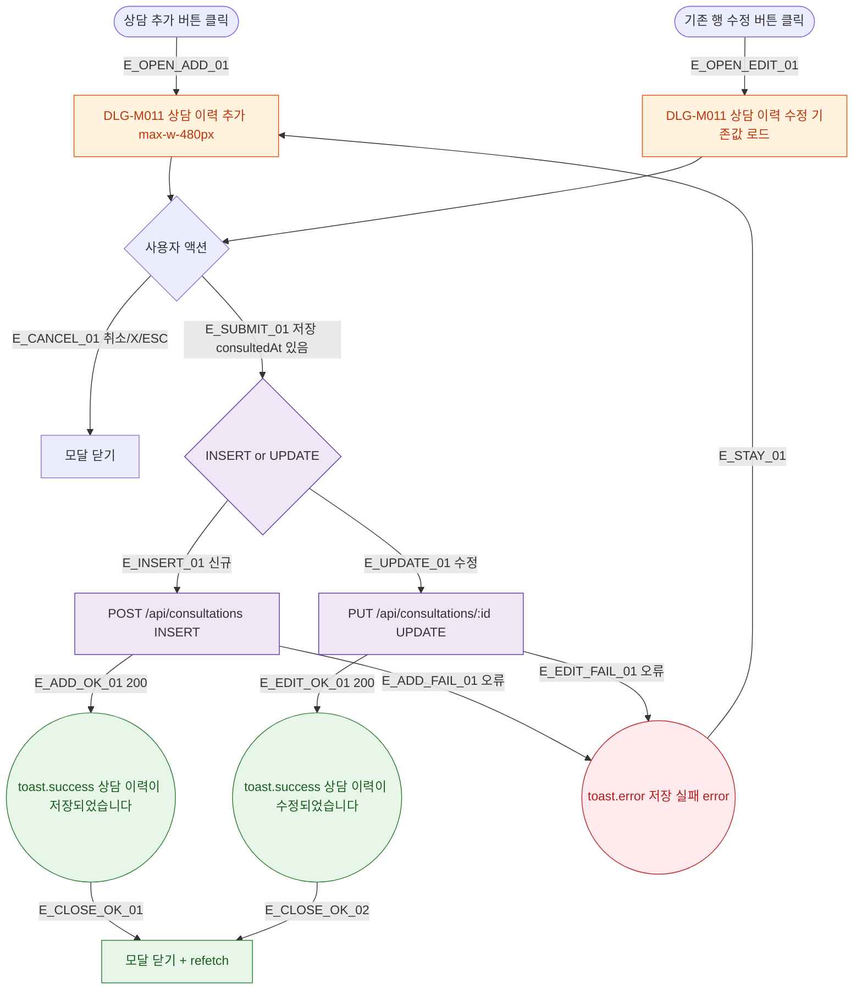

## 1. 목적

DLG-M011 상담 이력 추가/수정 다이얼로그의 열기/닫기/완료 생명주기를 명세한다.

## 2. 트리거/전제조건

- 상담이력 탭 > "상담 추가" 버튼 클릭 (신규)
- 또는 기존 행 "수정" 버튼 클릭 (수정)

## 3. 다이어그램

## 4. 엣지 설명

| 엣지 ID | 출발 | 도착 | 조건 |
|---------|------|------|------|
| E_OPEN_ADD_01 | 상담 추가 | 모달(신규) | - |
| E_OPEN_EDIT_01 | 수정 버튼 | 모달(수정) | 기존값 로드 |
| E_SUBMIT_01 | 저장 | API 분기 | consultedAt 있음 |
| E_ADD_OK_01 | INSERT API | toast.success | 200 |
| E_EDIT_OK_01 | UPDATE API | toast.success | 200 |

## 5. TC 후보

| TC ID | 타입 | Given | When | Then |
|-------|------|-------|------|------|
| TC-DLG-M011-M1-01 | positive | 상담 추가 | 저장 200 | toast 저장됨 + 닫힘 + 갱신 |
| TC-DLG-M011-M1-02 | positive | 기존 행 수정 | 저장 200 | toast 수정됨 + 닫힘 + 갱신 |
| TC-DLG-M011-M1-03 | exception | API 오류 | 저장 | toast.error, 모달 유지 |
| TC-DLG-M011-M1-04 | positive | 모달 열림 | ESC | 모달 닫힘 |
