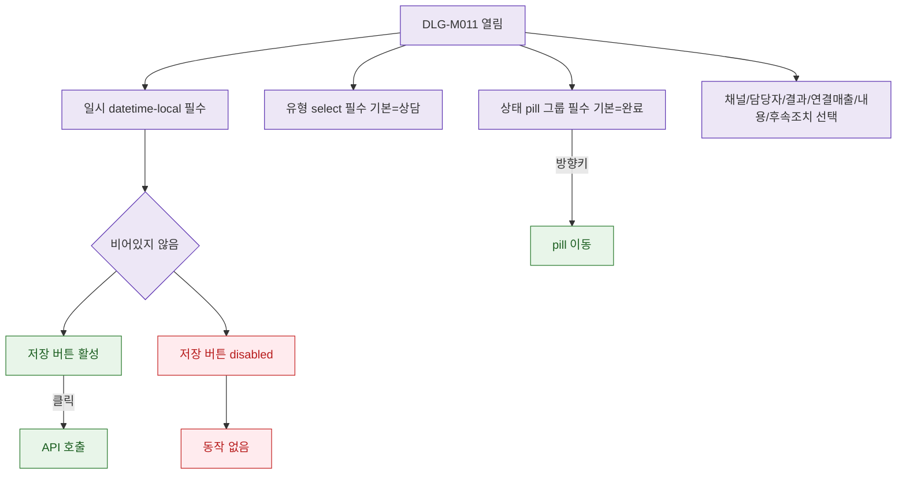

## 1. 목적

DLG-M011의 필드별 유효성 검증 흐름을 명세한다.

## 2. 트리거/전제조건

- DLG-M011 열린 상태

## 3. 다이어그램

## 4. 엣지 설명

| 출발 | 도착 | 조건 | |---------|------|------|------| | | 일시 확인 | 버튼 활성 | 입력됨 | | | 일시 확인 | 버튼 비활성 | 비어있음 | | | 상태 pill | 방향키 이동 | 키보드 |
