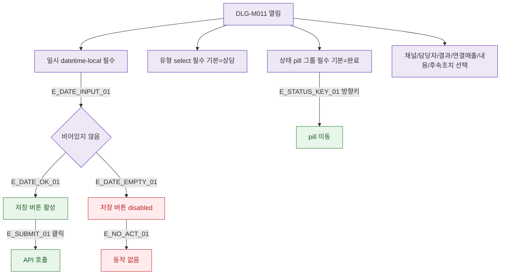

## 1. 목적

DLG-M011의 필드별 유효성 검증 흐름을 명세한다.

## 2. 트리거/전제조건

- DLG-M011 열린 상태

## 3. 다이어그램

## 4. 엣지 설명

| 엣지 ID | 출발 | 도착 | 조건 |
|---------|------|------|------|
| E_DATE_OK_01 | 일시 확인 | 버튼 활성 | 입력됨 |
| E_DATE_EMPTY_01 | 일시 확인 | 버튼 비활성 | 비어있음 |
| E_STATUS_KEY_01 | 상태 pill | 방향키 이동 | 키보드 |

## 5. TC 후보

| TC ID | 타입 | Given | When | Then |
|-------|------|-------|------|------|
| TC-DLG-M011-M2-01 | positive | 일시 입력 | 입력 | 버튼 활성 |
| TC-DLG-M011-M2-02 | negative | 일시 비어있음 | 저장 클릭 | 버튼 disabled |
| TC-DLG-M011-M2-03 | positive | 상태 pill | 방향키 | pill 이동 확인 |
