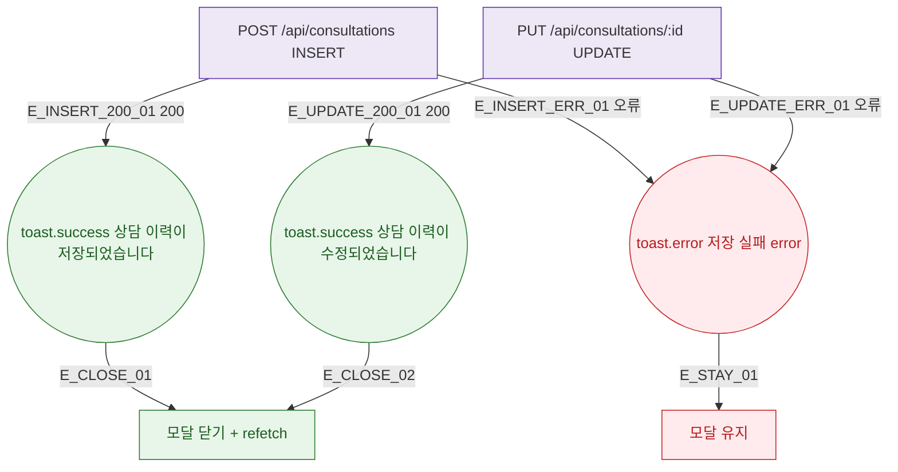

## 1. 목적

DLG-M011 상담 저장 API 응답별 결과 분기를 명세한다.

## 2. 트리거/전제조건

- POST 또는 PUT /api/consultations 호출 후

## 3. 다이어그램

## 4. 엣지 설명

| 엣지 ID | 출발 | 도착 | 조건 |
|---------|------|------|------|
| E_INSERT_200_01 | INSERT API | toast 저장됨 | 200 |
| E_UPDATE_200_01 | UPDATE API | toast 수정됨 | 200 |
| E_INSERT_ERR_01 | INSERT API | toast.error | 오류 |
| E_CLOSE_01 | toast | 닫기+갱신 | - |

## 5. TC 후보

| TC ID | 타입 | Given | When | Then |
|-------|------|-------|------|------|
| TC-DLG-M011-M3-01 | positive | INSERT 200 | 저장 | toast 저장됨 + 닫힘 + 갱신 |
| TC-DLG-M011-M3-02 | positive | UPDATE 200 | 저장 | toast 수정됨 + 닫힘 + 갱신 |
| TC-DLG-M011-M3-03 | exception | API 오류 | 저장 | toast.error + 모달 유지 |
