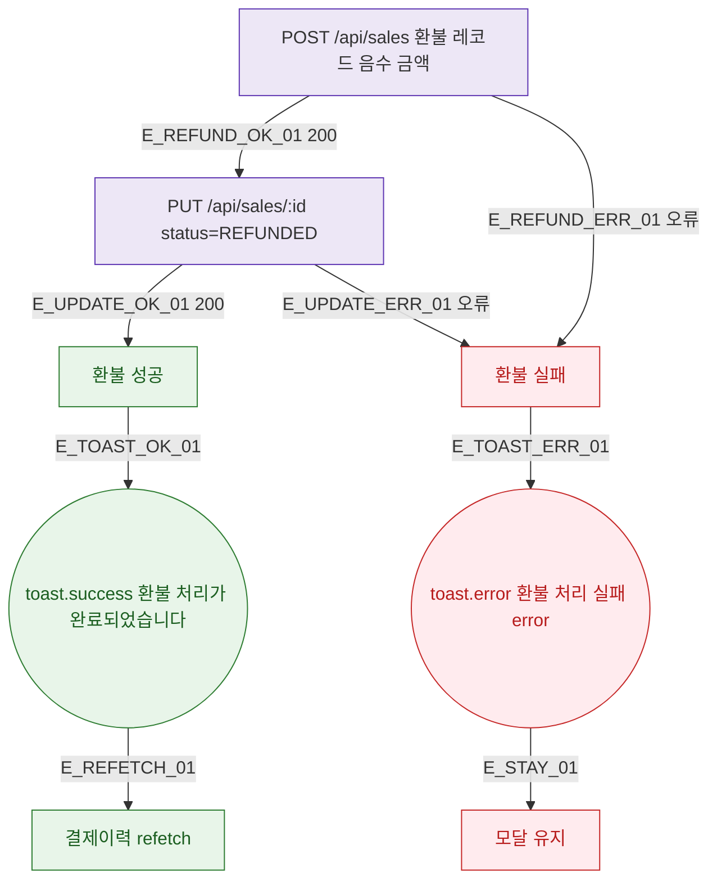

## 1. 목적

DLG-M013 환불 API 응답별 결과 분기를 명세한다.

## 2. 트리거/전제조건

- POST /api/sales (환불 레코드) + PUT 원본 status=REFUNDED 호출 후

## 3. 다이어그램

## 4. 엣지 설명

| 엣지 ID | 출발 | 도착 | 조건 |
|---------|------|------|------|
| E_REFUND_OK_01 | 환불 INSERT | 원본 UPDATE | 200 |
| E_UPDATE_OK_01 | 원본 UPDATE | 성공 | 200 |
| E_REFUND_ERR_01 | 환불 INSERT | 실패 | 오류 |
| E_TOAST_OK_01 | 성공 | toast.success | - |
| E_TOAST_ERR_01 | 실패 | toast.error | - |

## 5. TC 후보

| TC ID | 타입 | Given | When | Then |
|-------|------|-------|------|------|
| TC-DLG-M013-M3-01 | positive | 두 API 모두 200 | 환불 처리 | toast.success + 갱신 |
| TC-DLG-M013-M3-02 | exception | 환불 INSERT 오류 | 환불 처리 | toast.error + 모달 유지 |
| TC-DLG-M013-M3-03 | exception | 원본 UPDATE 오류 | 환불 처리 | toast.error + 모달 유지 |
