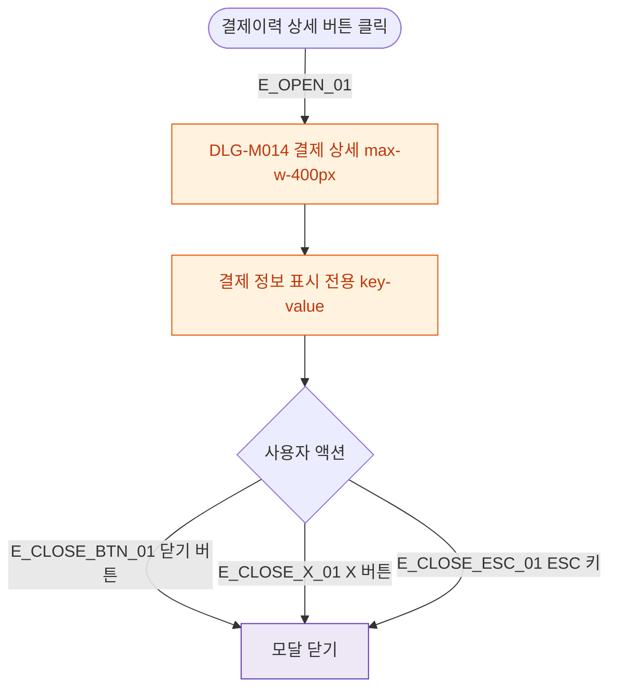

## 1. 목적

DLG-M014 결제 상세 조회 다이얼로그의 열기/닫기 생명주기를 명세한다.

## 2. 트리거/전제조건

- 결제이력/결제내역 탭 > "상세" 버튼 클릭

## 3. 다이어그램

## 4. 엣지 설명

| 엣지 ID | 출발 | 도착 | 조건 |
|---------|------|------|------|
| E_OPEN_01 | 상세 버튼 | 모달 열기 | - |
| E_CLOSE_BTN_01 | 닫기 버튼 | 모달 닫기 | - |
| E_CLOSE_X_01 | X 버튼 | 모달 닫기 | p-xs rounded-full |
| E_CLOSE_ESC_01 | ESC 키 | 모달 닫기 | - |

## 5. TC 후보

| TC ID | 타입 | Given | When | Then |
|-------|------|-------|------|------|
| TC-DLG-M014-M1-01 | positive | 결제 행 | 상세 클릭 | 모달 열림 + 정보 표시 |
| TC-DLG-M014-M1-02 | positive | 모달 열림 | 닫기 버튼 | 모달 닫힘 |
| TC-DLG-M014-M1-03 | positive | 모달 열림 | ESC | 모달 닫힘 |
