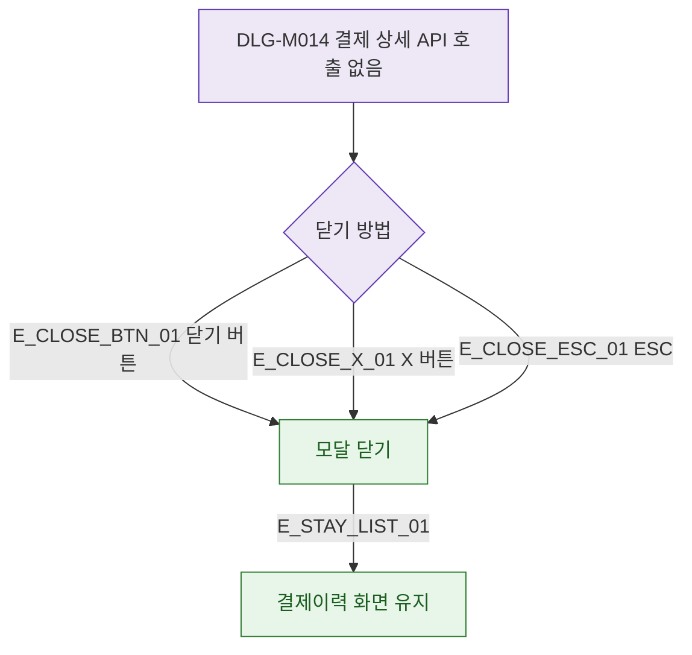

## 1. 목적

DLG-M014는 읽기 전용 모달로 API 호출 없음. 닫기 동작만 명세한다.

## 2. 트리거/전제조건

- DLG-M014 열린 상태

## 3. 다이어그램

## 4. 엣지 설명

| 엣지 ID | 출발 | 도착 | 조건 |
|---------|------|------|------|
| E_CLOSE_BTN_01 | 닫기 버튼 | 모달 닫기 | - |
| E_CLOSE_X_01 | X 버튼 | 모달 닫기 | - |
| E_CLOSE_ESC_01 | ESC | 모달 닫기 | - |

## 5. TC 후보

| TC ID | 타입 | Given | When | Then |
|-------|------|-------|------|------|
| TC-DLG-M014-M3-01 | positive | 모달 열림 | 닫기 버튼 | 모달 닫힘, 목록 유지 |
| TC-DLG-M014-M3-02 | positive | 모달 열림 | ESC | 모달 닫힘 |
