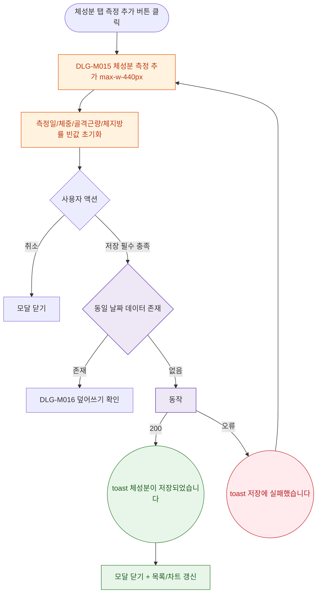

## 1. 목적

DLG-M015 체성분 측정 추가 다이얼로그의 열기/닫기/완료 생명주기를 명세한다.

## 2. 트리거/전제조건

- 체성분 탭 > "측정 추가" 버튼 클릭

## 3. 다이어그램

## 4. 엣지 설명

| 출발 | 도착 | 조건 | |---------|------|------|------| | | 측정 추가 | 모달 열기 | - | | | 저장 | 날짜 중복 확인 | 필수 충족 | | | 날짜 확인 | 덮어쓰기 모달 | 중복 존재 | | | 날짜 확인 | API | 새 데이터 | | | API | toast | 200 | | | API | toast | 오류 |
